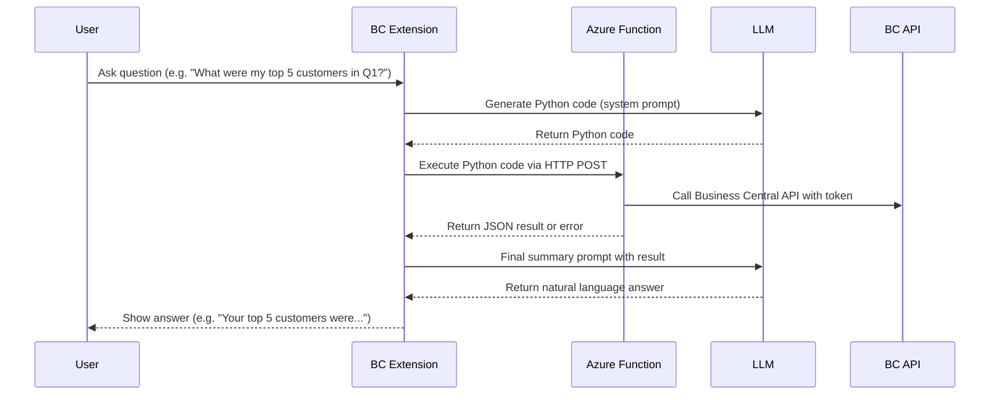

# Business Central Code Interpreter

## Overview

This project provides a natural language data analysis solution for Microsoft Dynamics 365 Business Central. It enables users to ask business questions in plain language and receive insightful answers, powered by Azure OpenAI and Azure Functions.

The system works by:
1. Taking natural language questions from users
2. Generating Python code to analyze the requested data
3. Executing that code securely in the cloud
4. Processing Business Central data through its API
5. Presenting user-friendly results back to the business user

## Repository Structure

This repository contains the following components:

- **[Business Central Extension](business-central-app/README.md)**: The AL extension that integrates with Business Central and provides the user interface for interacting with the Code Interpreter
- **[Azure Function](azure-function/README.md)**: The secure Python execution environment that processes data from Business Central

## Architecture

## Prerequisites

- Microsoft Dynamics 365 Business Central (2024 Wave 2/v26.0 or higher)
- Azure subscription with:
  - Azure OpenAI service
  - Azure Function App (Python runtime)
- Business Central environment with API access configured
- App registration in Azure Active Directory with appropriate permissions

## Getting Started

1. Set up the Azure Function by following the instructions in the [Azure Function README](azure-function/README.md)
2. Deploy the Business Central extension as described in the [Business Central App README](business-central-app/README.md)
3. Configure the connection between the components
4. Start asking business questions in natural language!

## Sample Questions

Here are some examples of questions you can ask:

- "What were my top 5 customers by sales last quarter?"
- "Show me the inventory items with the highest turnover rate"
- "Analyze the trend of overdue invoices over the past 6 months"
- "Which products have the highest profit margin?"
- "Compare sales performance across regions for the last fiscal year"
- "Identify customers with declining purchase patterns"

## Security and Privacy

This solution prioritizes security and privacy:

- All data processing happens within your Azure subscription
- No business data is sent to external services outside your control
- Azure OpenAI is only used for code generation and result interpretation
- The Azure Function execution environment is securely sandboxed
- Authentication to Business Central API uses secure OAuth2 with minimal permissions

For detailed security information, see the [Azure Function README](azure-function/README.md#security-considerations).

## Development and Customization

You can extend this solution by:

- Adding new helper functions to the Azure Function
- Enhancing the prompts used for code generation and result interpretation
- Creating specialized UI elements for specific types of questions
- Adding support for additional visualizations and data presentation options

For local development instructions, see the component-specific README files.

## License

This project is provided under the [MIT License](LICENSE).

## Support

For support, please contact dmitry@katson.com.

---

*Empowering Business Central users with AI-driven data analysis* 