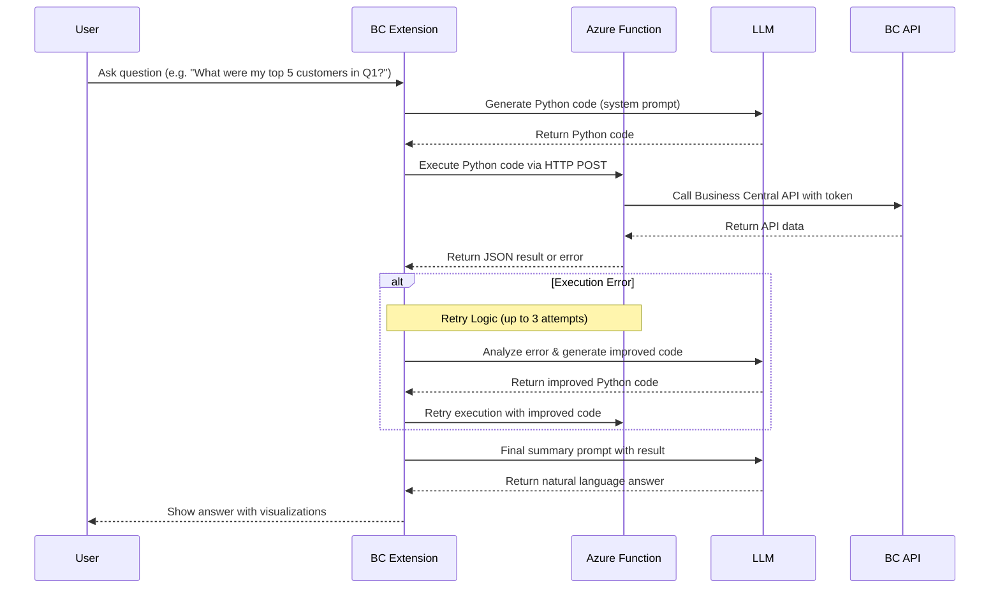

# Business Central Code Interpreter

## Overview

This project provides a natural language data analysis solution for Microsoft Dynamics 365 Business Central. It enables users to ask business questions in plain language and receive insightful answers with visualizations, powered by Azure OpenAI and Azure Functions.

The system works by:
1. Taking natural language questions from users
2. Generating Python code to analyze the requested data
3. Executing that code securely in the cloud
4. Processing Business Central data through its API
5. Presenting user-friendly results back to the business user

## Repository Structure

This repository contains the following components:

- **[Business Central Extension](business-central-app/README.md)**: The AL extension that integrates with Business Central and provides the user interface for interacting with the Code Interpreter
- **[Azure Function](azure-function/README.md)**: The secure Python execution environment that processes data from Business Central

## Architecture

## Prerequisites

- Microsoft Dynamics 365 Business Central (2024 Wave 2/v26.0 or higher)
- Azure subscription with:
  - Azure OpenAI service (GPT-4 recommended)
  - Azure Function App (Python 3.10+ runtime)
- Business Central environment with API access configured
- App registration in Azure Active Directory with appropriate permissions

## Getting Started

1. **Azure OpenAI Setup**
   - Create an Azure OpenAI resource
   - Deploy a model (GPT-4 recommended)
   - Note the endpoint and API key

2. **Azure Function Setup**
   - Create a Function App with Python 3.10+ runtime
   - Register an app in Azure AD with Business Central API permissions (API.ReadWrite.All)
   - Configure environment variables (`BC_TENANT_ID`, `BC_CLIENT_ID`, `BC_CLIENT_SECRET`)
   - Deploy the function code from the [azure-function](azure-function/) directory

3. **Business Central Extension Setup**
   - Deploy the AL extension to your Business Central environment
   - Configure OpenAI and Function details in the setup page
   - Activate the Copilot capability in BC settings

4. Start asking business questions in natural language!

## Sample Questions

Here are some examples of questions you can ask:

- "What were my top 5 customers by sales last quarter?"
- "Show me the inventory items with the highest turnover rate"
- "Analyze the trend of overdue invoices over the past 6 months"
- "Which products have the highest profit margin?"
- "Compare sales performance across regions for the last fiscal year"
- "Identify customers with declining purchase patterns"

## How It Works

1. **User Query**: The user submits a natural language question through the Business Central interface
2. **Code Generation**: Azure OpenAI generates Python code based on the question
3. **Code Execution**: The code is executed securely in an Azure Function
4. **Data Retrieval**: The function retrieves data from Business Central using the API
5. **Data Processing**: Python libraries (pandas, numpy, matplotlib) analyze and visualize the data
6. **Smart Retry**: If errors occur, the system analyzes them and automatically improves the code
7. **Answer Formation**: Results are passed back to Azure OpenAI to create a human-friendly answer
8. **Presentation**: The user receives an answer with text and visualizations

## Security and Privacy

This solution prioritizes security and privacy:

- All data processing happens within your Azure subscription
- No business data is sent to external services outside your control
- Azure OpenAI is only used for code generation and result interpretation
- The Azure Function execution environment is securely sandboxed
- Authentication to Business Central API uses secure OAuth2 with minimal permissions
- Dangerous Python modules and functions are blocked in the execution environment

For detailed security information, see the [Azure Function README](azure-function/README.md#security-considerations).

## Development and Customization

You can extend this solution by:

- Adding new helper functions to the Azure Function
- Enhancing the prompts used for code generation and result interpretation
- Creating specialized UI elements for specific types of questions
- Adding support for additional visualizations and data presentation options
- Implementing custom data transformations for specific business needs

For local development instructions, see the component-specific README files.

## Troubleshooting

If you encounter issues:

- Check Azure OpenAI and Function settings in the Business Central setup page
- Verify Copilot capability is activated in Business Central
- Ensure Function URL format is correct (should include `/api/execute`)
- Check Application Insights logs for detailed error messages
- Verify environment variables are correctly set in Azure Function
- For complex operations, consider upgrading to a premium Function plan

## License

This project is provided under the [MIT License](LICENSE).

## Support

For support, please contact dmitry@katson.com.

---

*Empowering Business Central users with AI-driven data analysis* 