# Business Central Code Interpreter

## Overview

This project provides a natural language data analysis solution for Microsoft Dynamics 365 Business Central. It enables users to ask business questions in plain language and receive insightful answers with visualizations, powered by Azure OpenAI and Azure Functions.

The system works by:
1. Taking natural language questions from users
2. Generating Python code to analyze the requested data
3. Executing that code securely in the cloud
4. Processing Business Central data through its API
5. Presenting user-friendly results back to the business user

## Repository Structure

This repository contains the following components:

- **[Business Central Extension](business-central-app/README.md)**: The AL extension that integrates with Business Central and provides the user interface for interacting with the Code Interpreter
- **[Azure Function](azure-function/README.md)**: The secure Python execution environment that processes data from Business Central

## Architecture

```mermaid
sequenceDiagram
    participant User
    participant BC Extension
    participant Azure Function
    participant LLM
    participant BC API

    User->>BC Extension: Ask question (e.g. "What were my top 5 customers in Q1?")
    BC Extension->>LLM: Generate Python code (system prompt)
    LLM-->>BC Extension: Return Python code
    
    BC Extension->>Azure Function: Execute Python code via HTTP POST
    Azure Function->>BC API: Call Business Central API with token
    BC API-->>Azure Function: Return API data
    Azure Function-->>BC Extension: Return JSON result or error
    
    rect rgb(85, 85, 85)
        Note over BC Extension,Azure Function: Retry Logic (up to 3 attempts)
        BC Extension->>LLM: Analyze error, review data & generate improved code
        LLM-->>BC Extension: Return improved Python code
        BC Extension->>Azure Function: Retry execution with improved code
    end
    
    BC Extension->>LLM: Final summary prompt with result
    LLM-->>BC Extension: Return natural language answer
    BC Extension-->>User: Show answer with visualizations
```

