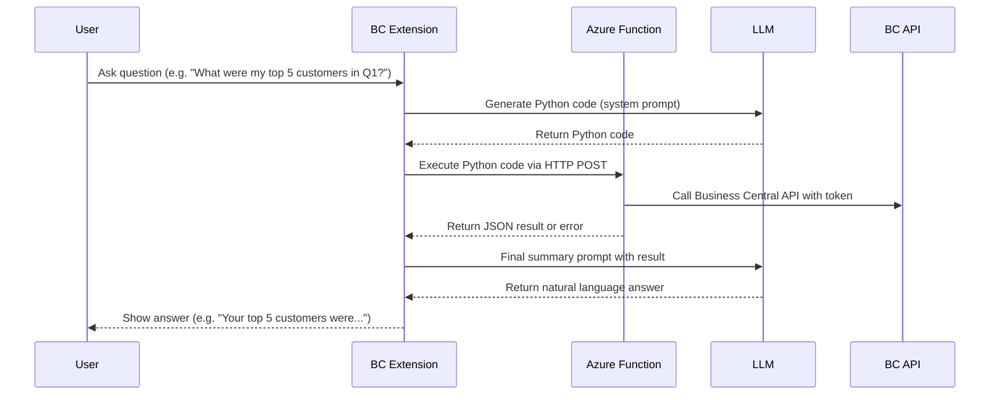

# Product Requirements Document (PRD)

## Project: Cloud Code Interpreter for Business Central

---

## 📅 Overview
Build a solution that enables Business Central users to ask data-related questions in natural language. The system uses AI to:
1. Generate Python code.
2. Execute that code in a secure Azure Function.
3. Process Business Central data via API.
4. Return results for further AI-based summarization.
5. Display the final answer to the user.

---

## 🛠️ General Flow



---

## ☁️ Azure Function Part

### Function Overview
- Accepts POST requests with dynamic Python code
- Provides `get_bc_data(relative_url, environment)` helper
- Executes code safely (sandboxed)
- Returns:
  - Direct JSON output if successful (matching Python's output structure)
  - Plain text error if execution fails

### Requirements
- Runtime: Python 3.10+, Azure Functions v2 programming model
- Exposed endpoint: `POST /api/execute`

### File Structure
```
project/
├── function_app.py      # main logic
├── requirements.txt     # dependencies
├── host.json            # Azure Functions host config
├── local.settings.json  # for local dev only
```

### Environment Variables
| Key               | Required | Description                                   |
|------------------|----------|-----------------------------------------------|
| `BC_TENANT_ID`    | ✅        | AAD tenant ID                                 |
| `BC_CLIENT_ID`    | ✅        | App registration client ID                    |
| `BC_CLIENT_SECRET`| ✅        | App registration secret                       |

### Standard Output Format
All Python code MUST use this structured output format:
```python
output = {
    "data": result,       # Main analysis result (any JSON-serializable data)
    "chart_images": []    # Array of base64-encoded images (empty if no charts)
}
```

### Sample Input Payload
```json
{
  "code": "data = get_bc_data(\"v2.0/companies({companyId})/customers\", \"sandbox\")\ndf = pd.DataFrame(data[\"value\"])\nresult = df[\"balance\"].sum()\noutput = {\"data\": result, \"chart_images\": []}"
}
```

### Sample Output (Success)
```json
{
  "data": 14567.23,
  "chart_images": []
}
```

### Sample Output (With Visualization)
```json
{
  "data": {"Q1": 14567.23, "Q2": 18920.55, "Q3": 21080.99, "Q4": 19876.32},
  "chart_images": ["iVBORw0KGgoAAAANSUhEUgAA..."]
}
```

### Sample Output (Error)
```
No 'output' variable returned from the script.
```

or

```
Python Error: Exception message
Traceback (most recent call last):
  File "<string>", line 5, in <module>
KeyError: 'balance'
```

---

## 💻 Business Central Extension Part

### Flow Summary
1. User asks a question (free text)
2. Extension sends system prompt to LLM to generate Python code
3. AL calls Azure Function with the generated code
4. Parses response:
   - If successful JSON (with `data` and `chart_images`), send it back to LLM for summarization
   - If error, analyze the error, generate diagnostic code, and retry with improved code
5. Displays final answer and any visualizations in Copilot UI

### AL Responsibilities
- Compose LLM system/user prompts with standardized output requirements
- Handle `HttpClient` requests to Azure Function
- Parse JSON responses or plain text errors
- Implement retry logic with error analysis for improved robustness
- Handle visualization rendering from base64-encoded images
- Display final message in user-friendly way

### Retry Logic
The system implements a generate > execute > retry loop:
1. If code execution fails, the error is analyzed
2. Diagnostic code is generated and executed to understand API structure
3. Improved code is generated based on error analysis
4. This process repeats up to 3 times before giving up

---

## ✨ Notes
- The system supports flexible Python logic using `pandas`, `numpy`, `matplotlib`, `scikit-learn`, etc.
- All execution happens in cloud — nothing is run locally in BC.
- Execution is sandboxed; restricted modules are blocked (`os`, `sys`, etc.)
- Visualizations are returned as base64-encoded strings in the `chart_images` array
- The system works with both standard and custom Business Central APIs
- API paths should follow specific formats based on API type:
  - Standard: `v2.0/companies({companyId})/entityName`
  - Custom: `{publisher}/{apiGroup}/{apiVersion}/companies({companyId})/{entitySetName}`

---