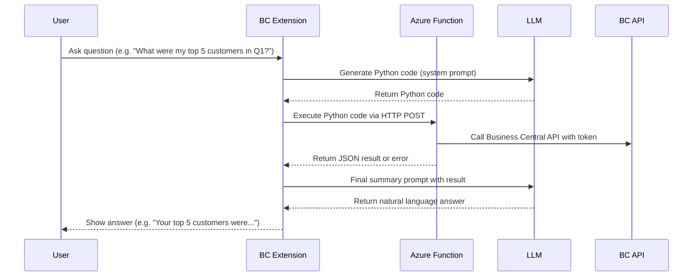

# Product Requirements Document (PRD)

## Project: Cloud Code Interpreter for Business Central

---

## 📅 Overview
Build a solution that enables Business Central users to ask data-related questions in natural language. The system uses AI to:
1. Generate Python code.
2. Execute that code in a secure Azure Function.
3. Process Business Central data via API.
4. Return results for further AI-based summarization.
5. Display the final answer to the user.

---

## 🛠️ General Flow



---

## ☁️ Azure Function Part

### Function Overview
- Accepts POST requests with dynamic Python code
- Provides `get_bc_data(relative_url, environment)` helper
- Executes code safely (sandboxed)
- Returns:
  - `result` field (JSON) if successful
  - Plain text error if execution fails

### Requirements
- Runtime: Python 3.10+, Azure Functions v2 programming model
- Exposed endpoint: `POST /api/main`

### File Structure
```
project/
├── function_app.py      # main logic
├── requirements.txt     # dependencies
├── host.json            # Azure Functions host config
├── local.settings.json  # for local dev only
```

### Environment Variables
| Key               | Required | Description                                   |
|------------------|----------|-----------------------------------------------|
| `BC_TENANT_ID`    | ✅        | AAD tenant ID                                 |
| `BC_CLIENT_ID`    | ✅        | App registration client ID                    |
| `BC_CLIENT_SECRET`| ✅        | App registration secret                       |

### Sample Input Payload
```json
{
  "code": "data = get_bc_data(\"companies({companyId})/customers\", \"sandbox\")\ndf = pd.DataFrame(data[\"value\"])\noutput = df[\"balance\"].sum()"
}
```

### Sample Output (Success)
```json
{ "result": 14567.23 }
```

### Sample Output (Error)
```
Error: No 'output' variable returned from the script.
```

---

## 💻 Business Central Extension Part

### Flow Summary
1. User asks a question (free text)
2. Extension sends system prompt to LLM to generate Python code
3. AL calls Azure Function with the generated code
4. Parses response:
   - If `result`, send it back to LLM for summarization
   - If error, fall back to simpler response or inform user
5. Displays final answer in Copilot UI

### AL Responsibilities
- Compose LLM system/user prompts
- Handle `HttpClient` requests to Azure Function
- Parse plain text or JSON responses
- Retry or fallback in case of error
- Display final message in user-friendly way

---

## ✨ Notes
- The system supports flexible Python logic using `pandas`, `numpy`, `scikit-learn`, etc.
- All execution happens in cloud — nothing is run locally in BC.
- Execution is sandboxed; restricted modules are blocked (`os`, `sys`, etc.)
- You can easily extend this system for chart generation or predictions.

---
